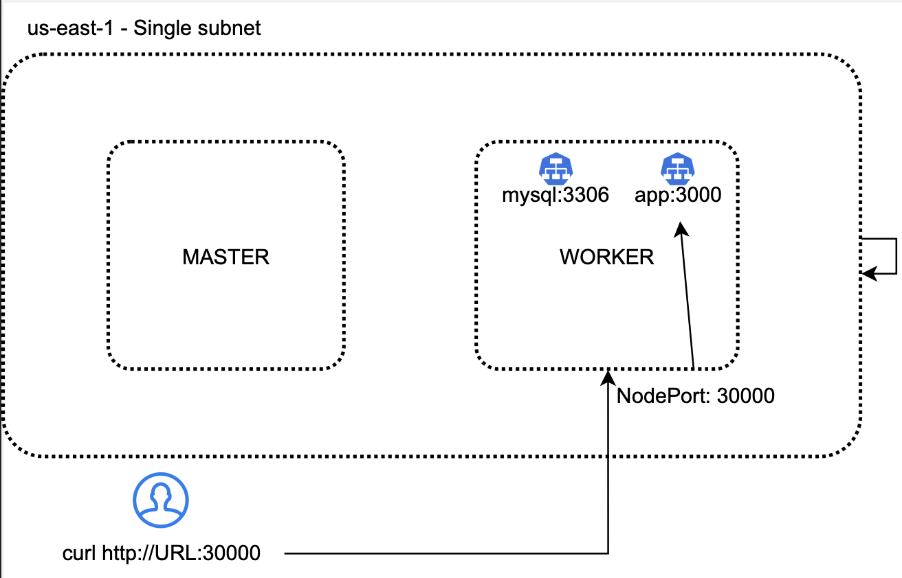
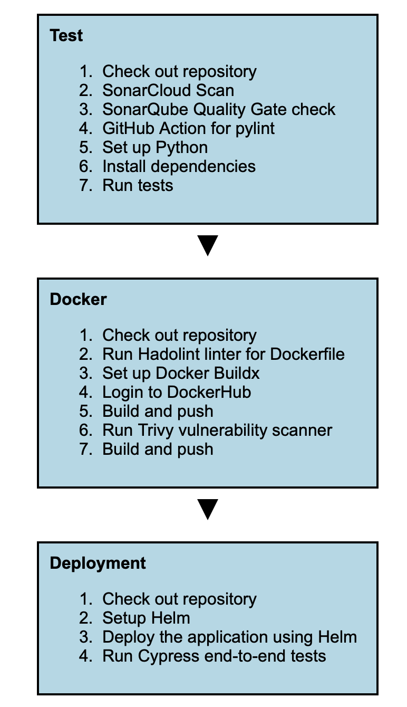

#k8s-practice

This is a repository for practicing kubernetes.

## Tech Stack

### Infrastructure

-  Docker
-  AWS
-  Kubernetes
-  Terraform
-  Helm

### CI/CD

-  Python
-  Hadolint
-  Pylint
-  SonarQube
-  Trivy
-  Cypress

## IMPORTANT

Change values in terraform/variables.tf file. Also you need to create a aws-secret inside terraform/ebs.tf file. 

## Terraform

Terraform folder contains terraform files for creating a kubernetes cluster on AWS. Change variables and run the following commands:

    terraform init
    terraform plan
    terraform apply

## Infra Diagram

    
p>

## Pipelines

app.yml contains test,build and deploy jobs. It is used for building and deploying the application to Kubernetes cluster.

Test job uses SonarQube, Hadolint and runs unit tests. Build job builds the Docker image and pushes it to DockerHub. Deploy job deploys the application to Kubernetes cluster. After deploying the application checks the application health with Cypress.

    
p>